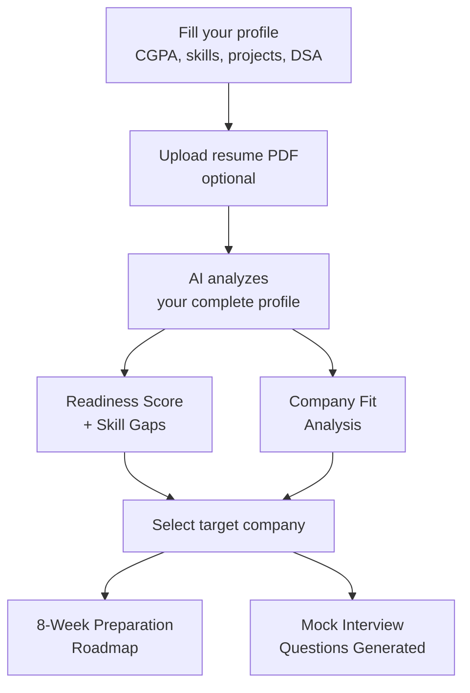

<div align="center">

# 🎯 Placement Readiness Analyzer

### Brutally honest AI feedback on your placement preparation — free, specific, actionable.

[](https://placement-readiness-analyzer.streamlit.app/)


**[🚀 Try Live App](https://placement-readiness-analyzer.streamlit.app/)** · **[Report Bug](https://github.com/princemittalr/placement-readiness-analyzer/issues)** · **[Request Feature](https://github.com/princemittalr/placement-readiness-analyzer/issues)**

</div>

---

## ⚠️ Warning

**This tool gives honest feedback. Not fake motivation.**

If you're not ready, it will tell you — with exactly what to fix and how long it will take.

---

## 🔍 The Problem

Every year, thousands of Indian engineering students walk into placement drives **completely unprepared** — not because they're not smart, but because nobody told them the truth.

- Career counselors are unavailable or unaffordable (₹500–2000/session)
- College placement cells focus on top students, not everyone
- First-generation students have zero alumni network or mentorship
- Students don't know what companies actually look for until it's too late
- Everyone says "prepare DSA" but nobody says *how much* or *which topics*

**The result:** Talented students get rejected — not for lack of ability, but lack of direction.

---

## ✅ The Solution

A free AI platform that gives every engineering student access to the kind of honest, specific placement guidance that used to cost money or require connections.

Enter your profile. Get your truth.

---

## 🌟 What You Get

### 1. 📊 Placement Readiness Score
A 0–100 score based on your actual profile — CGPA, skills, projects, DSA level, communication, and more.

### 2. 🔍 Skill Gap Analysis
Exactly what's missing. Not generic advice — specific gaps for your branch, year, and target company.

### 3. 🗺️ Company-Specific Preparation Roadmap
Choose your target:

| Company Type | What you get |
|---|---|
| TCS / Infosys / Wipro | Aptitude focus, verbal skills, HR prep |
| Zoho / Freshworks | Product thinking, coding rounds, DSA depth |
| Amazon / Microsoft / Google | LeetCode strategy, system design, behavioral |
| Early-stage Startup | Portfolio emphasis, full-stack awareness |

Each roadmap includes: exact topics, LeetCode strategy, free resources, 8-week plan, and red flags that instantly get you rejected.

### 4. 🎤 Mock Interview Question Generator
Select your target company and interview round. Get:
- 5 technical questions at your exact level
- 3 HR/behavioral questions with strong answer structures
- 1 trick question that company is actually known for asking
- Common mistakes that fail candidates at that specific company

---

## 🚀 How It Works



---

## 🖥️ Run Locally

```bash
# 1. Clone the repository
git clone https://github.com/princemittalr/placement-readiness-analyzer.git
cd placement-readiness-analyzer

# 2. Install dependencies
pip install -r requirements.txt

# 3. Set your Groq API key (free at console.groq.com)
export GROQ_API_KEY="your_key_here"

# 4. Run the app
streamlit run placement_analyzer.py
```

---

## 🛠️ Tech Stack

| Layer | Technology |
|---|---|
| Frontend | Streamlit |
| AI Model | LLaMA 3.3 70B via Groq API |
| Resume Parsing | PyPDF2 |
| Language | Python 3.10+ |
| Hosting | Streamlit Cloud (Free) |

---

## 🎯 Who Is This For?

- 🎓 Engineering students from 2nd year onwards
- 👨‍👩‍👧 First-generation students with no placement mentorship
- 😰 Students who failed interviews and don't know why
- 🎯 Students targeting specific companies and wanting focused prep
- 💸 Anyone who can't afford private placement coaching

---

## 🌍 Social Impact

Private placement coaching in India costs ₹500–2,000 per session. Top coaching institutes charge ₹20,000–50,000 for full programs.

This tool gives the same honest, specific guidance — **completely free** — to every student with an internet connection.

First-generation students. Rural college students. Students at tier-3 colleges with no alumni network.

**Everyone deserves to know the truth about where they stand — and exactly how to get better.**

---

## 📁 Project Structure

```
placement-readiness-analyzer/
├── placement_analyzer.py   # Main Streamlit application
├── requirements.txt        # Python dependencies
└── README.md               # This file
```

---

## 🗺️ Roadmap

- [ ] Resume ATS score checker
- [ ] Peer comparison (how you rank among similar profiles)
- [ ] Company-specific past interview question database
- [ ] Progress tracker (retake assessment monthly)
- [ ] Shareable PDF report generation

---

## 🤝 Contributing

Pull requests welcome. If you have insights on what specific companies look for:

1. Fork the repository
2. Update the relevant prompt in `placement_analyzer.py`
3. Verify your information is accurate and current
4. Submit a pull request with source/evidence

---

## 👨‍💻 Author

**Prince Mittal**
B.Tech CSE (AI/ML) · Dayananda Sagar University

[](https://linkedin.com/in/princemittalr)
[](https://github.com/princemittalr)

---

## 📄 License

MIT License — free to use, modify, and distribute.

---

<div align="center">

**Built for students who deserve honest guidance — not false hope.**

⭐ Star this repo if it helped your placement prep!

</div>
